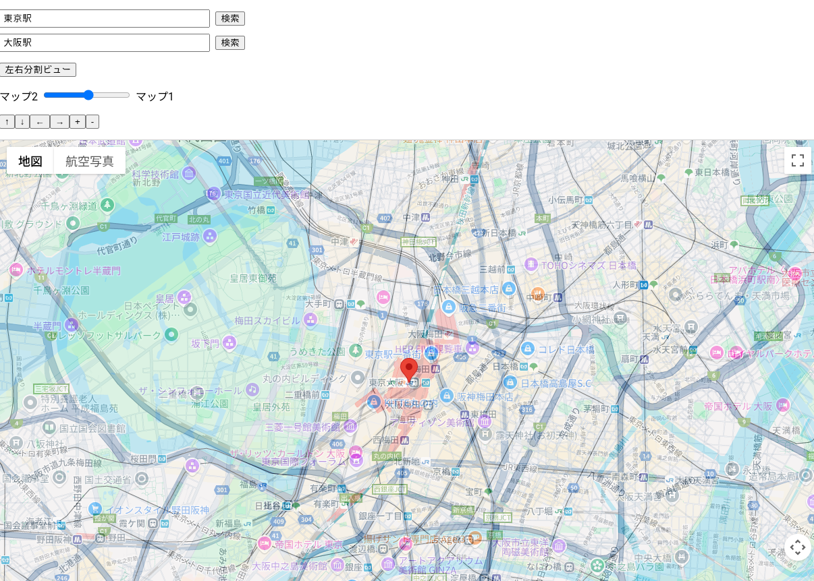
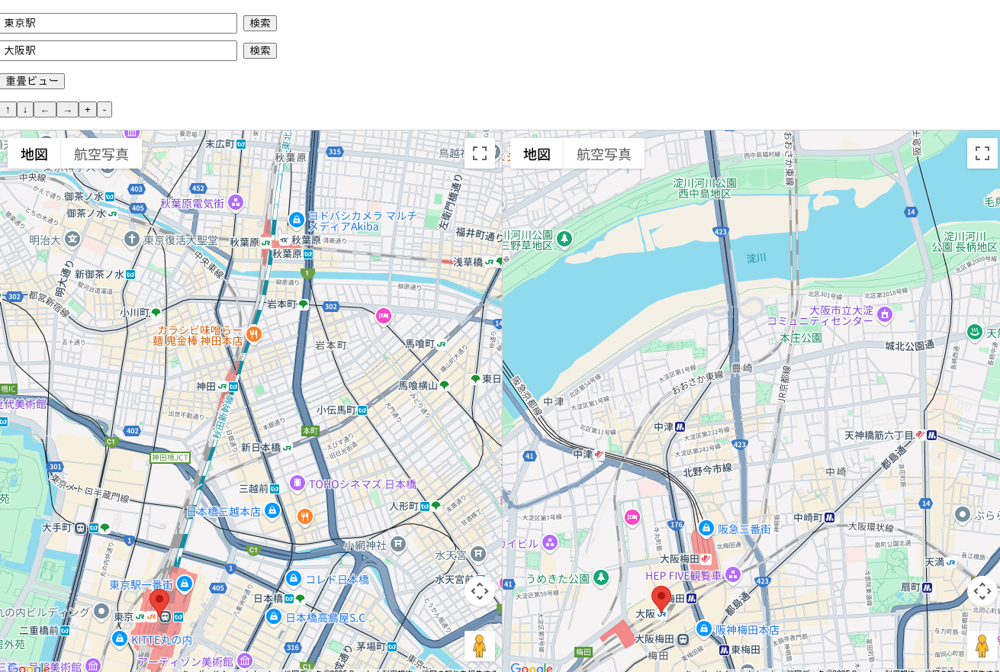

# geo-compare

**地図の距離感を超えて、「あの場所」と「この場所」を比べる**

このアプリは、全く異なる2つの場所の地図を同じ縮尺で並べて表示し、距離感やスケール感を直感的に比較できるWebアプリです。

🌍 **地理的に離れた場所の「スケール感」を比較**
* 見慣れた街の距離を基準に、知らない街のスケールが掴めます
* 観光や引っ越し先の検討にも活用できます
* 「この街は意外とコンパクトなんだな」「ここは広大だ」といった発見が得られます

## 主な機能

### 重畳ビュー
一方の地図を半透明にして、もう一方の地図に重ねて表示します。これにより、例えば「自分の街を、旅行先の街に重ねて大きさを比べる」といった直感的な比較が可能です。



### 左右分割ビュー
2つの地図を左右に並べて表示します。それぞれの地図を独立して操作（移動、ズーム）できますが、縮尺は常に同期されます。これにより、異なる場所の広さや距離を正確に比較できます。



## セットアップ

1.  **リポジトリをクローン:**
    ```bash
    git clone https://github.com/your-username/geo-compare.git
    cd geo-compare
    ```

2.  **依存関係をインストール:**
    ```bash
    npm install
    ```

3.  **Google Maps API の有効化**

    以下の手順を、Google Cloud Console（Webブラウザ）上で実行します。

    * Google Cloud Console にログイン
    * 対象プロジェクトを選択（Billing が有効なことを確認）
    * 「APIs & Services > Library」 で以下を検索して有効化：
        - **Maps JavaScript API**
        - **Geocoding API**
    * 「APIs & Services > Credentials」から API キーを作成または既存のキーを使用
    * 必要に応じて API キーの使用制限（リクエスト元のドメイン制限など）を設定

4.  **Google Maps APIキーを設定:**

    プロジェクトのルートに`.env`ファイルを作成して、手順3で取得したGoogle Maps APIキーを以下のように設定してください。

    ```sh:.env
    NEXT_PUBLIC_GOOGLE_MAPS_API_KEY="ここにあなたのAPIキーを貼り付け"
    ```
    ※`.env`ファイルは`.gitignore`に含まれているため、キーがリポジトリに公開されることはありません。

5.  **開発サーバーを起動:**
    ```bash
    npm run dev
    ```
    ブラウザで `http://localhost:3000` を開くと、アプリが表示されます。

## ライセンス

このプロジェクトは [GPL License](LICENSE) のもとで公開されています。

